# sensig-rigs-ros2
ROS2 System for sensing rigs subproject

---

## 1. Project Overview

This repository contains all ROS2 nodes required to run the sensig rigs module.

---

## 2. General ROS2 Architecture

### 2.1 Main Components

ROS2 is built around a **node/topic** architecture coordinated via **DDS** (Data Distribution Service):

- **Nodes**: independent processes executing specific tasks (e.g., sensors, planning, control)
- **Topics**: publish/subscribe communication channels for message exchange
- **Services**: synchronous request/response calls between nodes
- **Actions**: asynchronous tasks with feedback and cancellation support

### 2.2 High-Level Diagram
>Note: for better readability, the diagram can also be viewed [here](https://www.mermaidchart.com/raw/2519ee6e-2415-4bc7-981e-add9a7b19515?theme=light&version=v0.1&format=svg) 

```mermaid
%%{init: {
  "theme": "default",
  "flowchart":{"layout":"elk"}
}}%%

flowchart LR
    %% Camera nodes
    subgraph Sensors
        Camera1Node["Camera1Node"] 
        Camera2Node["Camera2Node"]
    end 
    

    %% Raw image topics
    Camera1Node -->|publishes <br> sensor_msgs/Image| qos1[/"/camera1/image_raw <br>(best_effort, depth=1)"/]
    Camera2Node -->|publishes <br> sensor_msgs/Image| qos2[/"/camera2/image_raw <br>(best_effort, depth=1)"/]


    %% Frame sync node & topic
    subgraph Preprocessing
        StereoSyncNode[StereoSyncNode]
    end
    StereoSyncNode -->|publishes <br> msg/StereoImages| stereo[/"/stereo_images <br>(best_effort, depth=1)"/]

    %% Processing nodes
    subgraph Processing
      MonoVisionNode[MonoVisionNode]
      StereoVisionNode[StereoVisionNode]
      VisualOdometryNode[VisualOdometryNode]
    end

    %% Subscriptions
    qos1 --> StereoSyncNode
    qos2 --> StereoSyncNode
    stereo --> MonoVisionNode
    stereo --> StereoVisionNode
    stereo --> VisualOdometryNode

    %% Output topics
    MonoVisionNode -->|publishes <br> custom_msgs/MonoOutput| monoOut[/"/mono_vision/output <br>(reliable, depth=10)"/]
    StereoVisionNode -->|publishes <br> custom_msgs/StereoOutput| stereoOut[/"/stereo_vision/output <br>(reliable, depth=10)"/]
    VisualOdometryNode -->|publishes <br> custom_msgs/Odometry| odomOut[/"/visual_odometry/output <br>(reliable, depth=10)"/]

    %% Packaging & modem
    subgraph Communication
      DataAggregator[DataAggregatorNode]
      ModemDriver[ModemDriverNode]
    end

    monoOut --> DataAggregator
    stereoOut --> DataAggregator
    odomOut --> DataAggregator

    DataAggregator -->|"publishes <br> std_msgs/String <br> (JSON)"| dataTopic[/"/data_to_modem <br>(reliable, depth=10)"/]
    dataTopic --> ModemDriver

    %% Definizione della classe
    classDef nodeClass fill:#ffcccc,stroke:#ff0000,stroke-width:2px;
    classDef topicClass fill:#fffe00,stroke:#ff000,stroke-width:2px;

    %% Assegnazione della classe ai nodi
    class Camera1Node,Camera2Node,MonoVisionNode,StereoVisionNode,VisualOdometryNode,DataAggregator,ModemDriver,StereoSyncNode nodeClass;
    class stereo,qos1,qos2,monoOut,stereoOut,odomOut,dataTopic topicClass;


```


The system is built with 4 main nodes blocks: 
- **Sensors**: Nodes which will obtain data
- **Preprocessing**: Nodes which will pre-process data, before sending to the **processing** block
- **Processing**: Nodes which will process data
- **Communication**: Nodes which will compress and send data thourgh an acoustic modem

**Sensors**,  **Preprocessing** and **Communication** will run on a **RaspberryPi 5**. <br>
**Processing**, given it's strong computational cost, will run on an **Nvidia Jetson Nano**.

### 2.3 Design Details

We designed 4 macro-groups in order to increare modularity. 

#### Sensors
- Nodes which publish frames obtained by cameras
   - Camera1Node<br>
   Gets frames from camera 1
   - Camera2Node<br>
   Gets frames from camera 2
- Run on ***Raspberry Pi 5***

#### Preprocessing
- Nodes which prepare the frames before sending them to the processing block
   - **StereoSyncNode**<br>
   By checking the timestamp, it syncronizes two frames and publishes them as a syncronized frame pair 
- Run on ***Raspberry Pi 5***


#### Processing
- Nodes which uses computer vision to retrieve data from images
   - **MonoVisionNode**<br>
   Classification with mono-vision (only one camera frame is used)
   - **StereoVisionNode**<br>
   Classification with stereo-vision
   - **VisualOdometryNode**<br>
   ?
- Run on ***Nvidia Jetson Nano***

#### Communication
- Nodes which compress and send data thorugh an acoustic modem
   - **DataAggregationNode**<br>
   Gets data from the processing block it aggregates them in standardized json files
   - **ModemDriverNode**<br>
   Compresses data and sends them through the acoustic modem
- Run on ***Raspberry Pi 5***

## 3. Run the project

The steps required to run the code vary between different boards


### Raspberry Pi

Run this command to start the container
```bash
docker compose run --rm raspberry
```

`cd` inside the directory, build the project and source it
```bash
cd sensing-rigs-ros2/ros2_ws
colcon build --symlink-install
source install/setup.bash
```

Launch the capture nodes
```bash
ros2 launch lifecycle_manager lifecycle_manager.launch.py 
```

**TEMPORARY SOLUTION** (a complete launch file will be made)<br>
Open a new terminal, ssh inside the raspberry, attach to running container
```bash
ssh admin@raspberrypi.local
docker exec -it $(docker ps -q --filter "ancestor=ghcr.io/nautilus-unipd/raspberry-setup:latest" | head -n 1) bash
```
`cd` inside the directory, source the project and run the preprocessing node
```bash
cd sensing-rigs-ros2/ros2_ws
source install/setup.bash
ros2 run sensig_preprocessing PreprocessingNode
```


### Jetson Nano
Run this command to start the container
```bash
docker compose run --rm jetson
```

`cd` inside the directory, build the project and source it
```bash
cd sensing-rigs-ros2/ros2_ws
colcon build --symlink-install
source install/setup.bash
```

Launch the processing nodes
```bash
ros2 launch cv_algorithms cv_algorithms_launch.py
```

---

**TEMPORARY TEST**
Launch the test_receiver node
```bash
ros2 run test_receiver test_ImagePair
```

On the host machine, run
```bash
ssh -L 8080:jetson-nano.local:8080 admin@raspberrypi.local
```
and then open 
```bash
localhost:8080
```
on your browser to view the images


